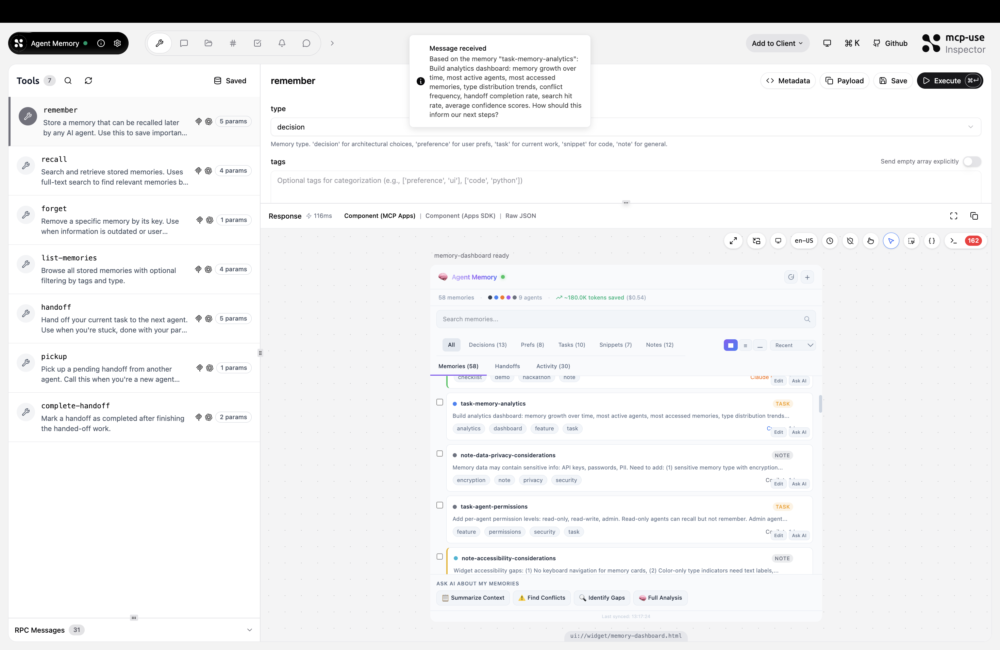
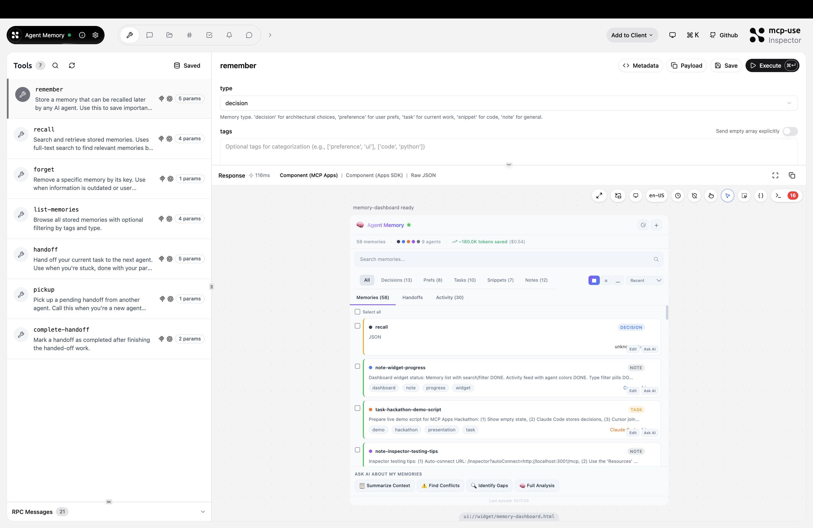
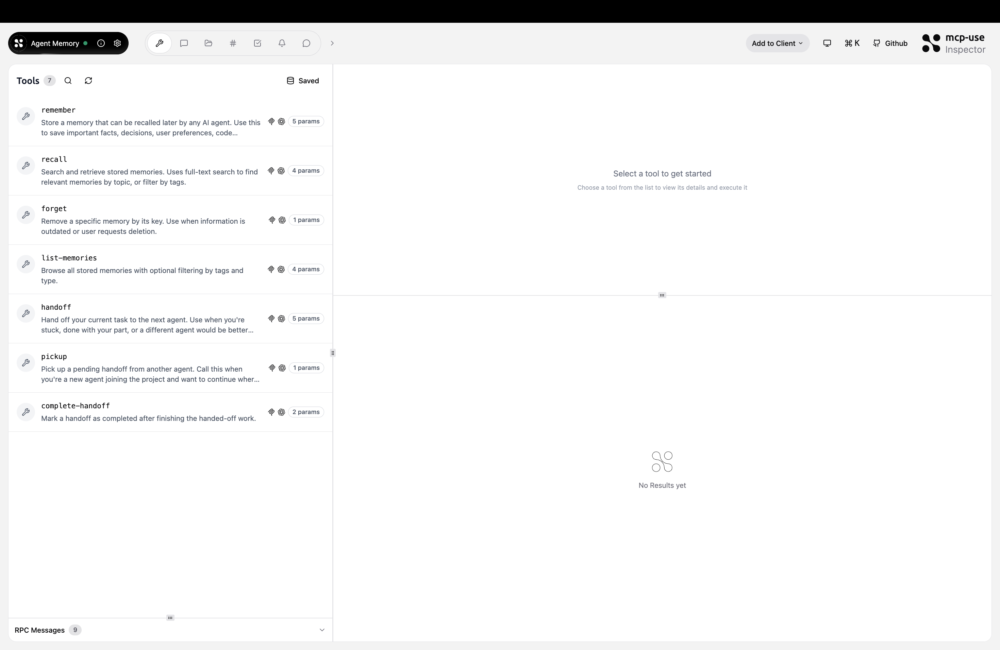
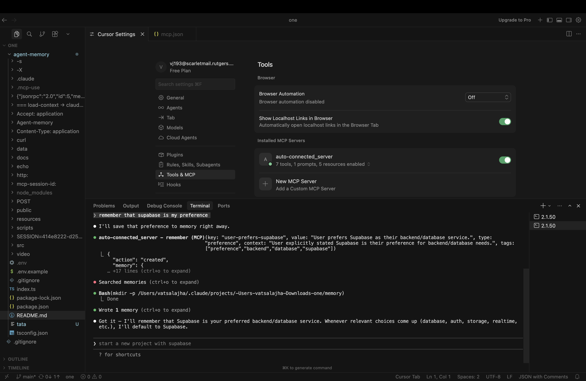
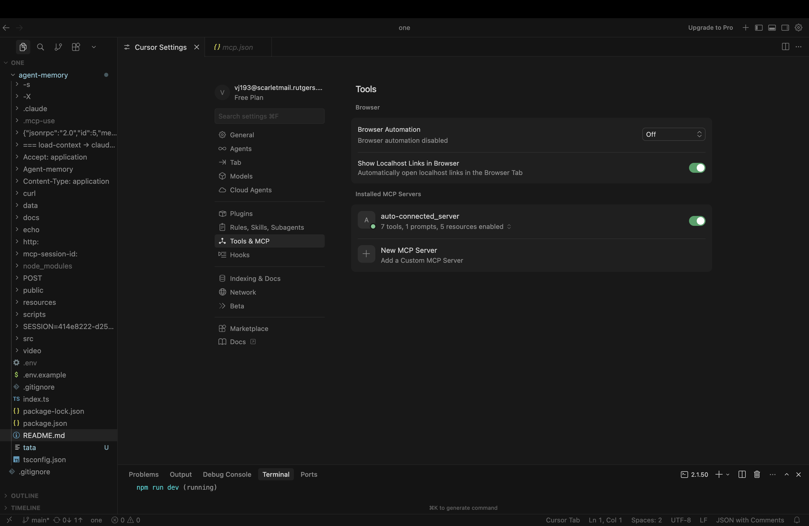

<div align="center">

# Agent Memory

### The shared memory layer that lives *inside* your AI conversations

[](https://events.ycombinator.com/manufact-hackathon26)
[](https://manufact.com)
[](#-connect-now)

[](https://typescriptlang.org)
[](https://react.dev)
[](https://sqlite.org)
[](https://tailwindcss.com)
[](https://nodejs.org)
[](https://vite.dev)

<br />

**Store context in Claude. Recall it in ChatGPT. See which agent knows what — right inside your conversation.**

No separate dashboards. No heavy ML dependencies. Just a universal memory layer that renders inline as an interactive widget.

<br />

[Connect Now](#-connect-now) · [The Problem](#-the-problem) · [Architecture](#%EF%B8%8F-architecture) · [Features](#-features) · [Tools & Resources](#-tools--resources) · [Quick Start](#-quick-start)

</div>

---

> *Every time an AI agent forgets and you re-explain your tech stack, preferences, and decisions — that's wasted tokens, wasted money, and wasted compute. Agent Memory eliminates repeat context by letting agents recall what they already know, cutting token usage by up to 60%.*

---
## Connecting Agent Memory as an MCP Server


---

## Structured Memory Creation



---

## Persistent Typed Memory Dashboard



---

## Categorized Memory Objects



---

## Storing Long-Term Preferences



---

## Cross-Tool Integration (Cursor)


---

## Connect Now

Add Agent Memory to any MCP-compatible client with a single URL:

```
https://winter-meadow-1651f.run.mcp-use.com/mcp
```

**Claude Desktop / Claude Code** — add to your MCP settings:
```json
{
  "mcpServers": {
    "agent-memory": {
      "url": "https://winter-meadow-1651f.run.mcp-use.com/mcp"
    }
  }
}
```

**ChatGPT** — connect via the Manufact MCP Apps marketplace.

**Cursor / VS Code / Windsurf / Cline / Roo Code / Goose / Codex** — paste the URL into your MCP server configuration.

---

## The Problem

Every AI conversation starts from zero. Your agent doesn't remember that you chose Supabase last week, that you prefer Tailwind over CSS modules, or that the auth system uses JWT. So you re-explain. Every. Single. Time.

### The math that makes this hurt

| Metric | Value |
|--------|-------|
| Average "re-context" per conversation | **~500–1,000 tokens** |
| Power user conversations/day (across Claude, ChatGPT, Cursor) | **20+** |
| Wasted tokens/day just repeating yourself | **10,000–20,000** |
| At scale (1M users) | **Billions of redundant tokens/month** |
| That equals | **Massive GPU hours = real carbon footprint** |

### The real cost

Every redundant token is a GPU cycle that didn't need to happen. At scale, repeated context isn't just annoying — it's an environmental problem. Billions of tokens reprocessed monthly across millions of users translates directly to unnecessary energy consumption and compute waste.

**Agent Memory is a green layer for AI — it remembers so the model doesn't have to re-compute. Less inference, less energy, less cost.**

Independent validation supports this: projects in the MCP memory space have demonstrated **65% token reduction** in Claude Code sessions and **30x token compression** ratios. The data is clear — persistent memory dramatically cuts redundant inference.

And with Agent Memory, you can **see your savings right inside the conversation** through our inline dashboard widget.

---

## What Makes Agent Memory Different

Existing memory solutions (MemoryMesh, Mem0, BasicMemory) all share the same limitation: **they require separate dashboards, external APIs, or heavy ML pipelines**. You store memories in one place and hope your agent finds them.

Agent Memory is the first shared memory MCP server with an **inline widget that renders directly inside your AI conversation**:

| Feature | Agent Memory | Other Solutions |
|---------|:---:|:---:|
| Inline widget inside conversations | **Yes** | No |
| Cross-agent memory (Claude + ChatGPT + Cursor) | **Yes** | Limited |
| Visual agent attribution (who stored what) | **Yes** | No |
| Agent-to-agent handoffs | **Yes** | No |
| Full-text search with BM25 ranking | **Yes** | Varies |
| Zero ML dependencies | **Yes** | Often heavy |
| Single URL to connect | **Yes** | Complex setup |

---

## Architecture

```
┌─────────────────────────────────────────────────────────────────────┐
│                        MCP CLIENTS                                  │
│  ┌──────────┐ ┌──────────┐ ┌──────────┐ ┌──────────┐ ┌──────────┐ │
│  │  Claude   │ │ ChatGPT  │ │  Cursor  │ │ VS Code  │ │  Goose   │ │
│  │   Code   │ │          │ │          │ │ Copilot  │ │  Codex   │ │
│  └────┬─────┘ └────┬─────┘ └────┬─────┘ └────┬─────┘ └────┬─────┘ │
│       │             │            │             │            │       │
└───────┼─────────────┼────────────┼─────────────┼────────────┼───────┘
        │             │            │             │            │
        └─────────────┼────────────┼─────────────┼────────────┘
                      │            │             │
                      ▼            ▼             ▼
              ┌──────────────────────────────────────┐
              │     HTTP Streamable MCP Protocol      │
              │  https://winter-meadow-1651f.run...   │
              └──────────────────┬───────────────────┘
                                 │
                                 ▼
┌────────────────────────────────────────────────────────────────────┐
│                      MCP SERVER LAYER                              │
│                                                                    │
│  ┌─────────────────────────────────────────────────────────────┐  │
│  │                     7 MCP TOOLS                              │  │
│  │  remember · recall · forget · list-memories                  │  │
│  │  handoff · pickup · complete-handoff                         │  │
│  └─────────────────────────────────────────────────────────────┘  │
│                                                                    │
│  ┌─────────────────────────────────────────────────────────────┐  │
│  │                    5 MCP RESOURCES                           │  │
│  │  memory://current-context · memory://agent-activity          │  │
│  │  memory://{key} · memory://handoff-queue · memory://changelog│  │
│  └─────────────────────────────────────────────────────────────┘  │
│                                                                    │
│  ┌─────────────────────────────────────────────────────────────┐  │
│  │                     1 MCP PROMPT                             │  │
│  │  session-briefing (full agent onboarding)                    │  │
│  └─────────────────────────────────────────────────────────────┘  │
└────────────────────────┬───────────────────────────────────────────┘
                         │
                         ▼
┌────────────────────────────────────────────────────────────────────┐
│                    PERSISTENCE LAYER                               │
│                                                                    │
│  ┌──────────────────────┐  ┌──────────────────────────────────┐   │
│  │   SQLite + WAL Mode   │  │   FTS5 Full-Text Search Engine   │  │
│  │                        │  │                                  │  │
│  │  memories             │  │   BM25 relevance ranking          │  │
│  │  tags                 │  │   Porter stemming + unicode61     │  │
│  │  activity_log         │  │   Auto-synced via triggers        │  │
│  │  handoffs             │  │                                  │  │
│  │  memory_history       │  │   Composite scoring:              │  │
│  │                        │  │   60% BM25 + 20% Recency         │  │
│  │  6 tables · 8 indexes │  │   + 10% Access + 10% Type        │  │
│  └──────────────────────┘  └──────────────────────────────────┘   │
└────────────────────────┬───────────────────────────────────────────┘
                         │
                         ▼
┌────────────────────────────────────────────────────────────────────┐
│                  INLINE WIDGET LAYER                               │
│                                                                    │
│  ┌─────────────────────────────────────────────────────────────┐  │
│  │              React 19 Interactive Dashboard                  │  │
│  │                                                               │  │
│  │  ┌───────────┐ ┌───────────┐ ┌───────────┐ ┌────────────┐  │  │
│  │  │  Memory   │ │  Search   │ │ Activity  │ │  Handoff   │  │  │
│  │  │  Browser  │ │  & Filter │ │   Feed    │ │  Manager   │  │  │
│  │  └───────────┘ └───────────┘ └───────────┘ └────────────┘  │  │
│  │                                                               │  │
│  │  Tailwind CSS v4 · Dark/Light Mode · Agent Color Coding     │  │
│  └─────────────────────────────────────────────────────────────┘  │
│                                                                    │
│         Renders INLINE inside Claude, ChatGPT, Cursor, etc.       │
└────────────────────────────────────────────────────────────────────┘
```

### Data Flow

```
Agent stores memory          Agent recalls memory          Agent hands off work
       │                            │                             │
       ▼                            ▼                             ▼
   remember()                   recall()                      handoff()
       │                            │                             │
       ▼                            ▼                             ▼
  SQLite INSERT              FTS5 MATCH query              Store handoff +
  + FTS5 trigger            + composite scoring            context_keys
       │                            │                             │
       ▼                            ▼                             ▼
  Activity logged            Ranked results                pickup() by
  + history saved            + access counted              next agent
       │                            │                             │
       ▼                            ▼                             ▼
  Widget shows               Widget displays              Widget shows
  "Memory saved!"            search results               full briefing
```

---

## Features

### Intelligent Memory System

- **5 memory types**: `decision` · `preference` · `task` · `snippet` · `note`
- **Full-text search** with SQLite FTS5 and BM25 relevance ranking
- **Composite scoring algorithm** that weighs relevance (60%), recency (20%), access patterns (10%), and type priority (10%)
- **Tag-based organization** with multi-tag filtering
- **Conflict detection** when different agents update the same memory

### Cross-Agent Collaboration

- **Universal MCP compatibility** — any client that speaks MCP can connect
- **Agent attribution** — every memory and action is tagged with which agent created it
- **Color-coded agent icons** — Claude (orange), ChatGPT (green), Cursor (blue), and 10+ more
- **Activity feed** — see exactly what each agent did and when

### Agent-to-Agent Handoffs

- **Structured work transfer** between agents with summary, context, and next steps
- **Context inheritance** — handoff includes references to relevant memories
- **Atomic status management** — `pending` → `in_progress` → `completed`
- **Handoff queue** — browse and accept pending handoffs from any agent

### Inline Dashboard Widget

- **Renders inside conversations** — no separate dashboard needed
- **Memory browser** with card and list views
- **Real-time search** with debounced FTS5 queries
- **Type and tag filtering** with visual badges
- **Quick-add form** for creating memories without tool calls
- **Activity timeline** showing cross-agent collaboration
- **Handoff viewer** with one-click pickup
- **Dark mode / light mode** support
- **Sorting** by creation date, update date, or access frequency

### Auto-Context Resource

The `memory://current-context` resource automatically surfaces your decisions, preferences, and recent tasks — so the agent already knows your context without you spending tokens re-explaining it. This is the core mechanism behind token savings.

---

## Tools & Resources

### MCP Tools

| Tool | Description |
|------|-------------|
| `remember` | Store a memory with key, value, type, tags, and context. Handles conflicts when different agents update the same key. |
| `recall` | Full-text search with FTS5 + BM25 composite scoring. Returns ranked results weighted by relevance, recency, and access patterns. |
| `forget` | Delete a memory by key with cascading cleanup of tags and history. |
| `list-memories` | Browse all memories with pagination, type filtering, and tag filtering. |
| `handoff` | Create an agent-to-agent work handoff with summary, stuck reason, next steps, and context memory references. |
| `pickup` | Accept a pending handoff. Auto-loads context memories and all relevant decisions/preferences for a full briefing. |
| `complete-handoff` | Mark a handoff as completed with an optional result summary. |

### MCP Resources

| URI | Description |
|-----|-------------|
| `memory://current-context` | Full project briefing: decisions, preferences, recent tasks, stats, pending handoffs. **This is what saves tokens.** |
| `memory://agent-activity` | Agent action feed — who did what and when across all connected agents. |
| `memory://{key}` | Look up a specific memory by key (e.g., `memory://project-db-schema`). |
| `memory://handoff-queue` | View all pending, in-progress, and recently completed handoffs. |
| `memory://changelog` | Memory modification history with old vs. new values and agent attribution. |

### MCP Prompt

| Name | Description |
|------|-------------|
| `session-briefing` | Full agent onboarding prompt. Optional `focus` parameter to filter context to a specific topic. |

---

## Composite Scoring Algorithm

When you `recall` a memory, Agent Memory doesn't just do keyword matching. It uses a composite scoring algorithm that considers multiple signals:

```
Score = (0.6 × BM25) + (0.2 × Recency) + (0.1 × AccessCount) + (0.1 × TypePriority)
```

| Signal | Weight | Formula | Why |
|--------|--------|---------|-----|
| **BM25 Relevance** | 60% | FTS5 built-in ranking | Most relevant results first |
| **Recency** | 20% | `1 / (1 + age_days × 0.1)` | Recent memories matter more |
| **Access Count** | 10% | `log(1 + count) / log(1 + max)` | Frequently used = important |
| **Type Priority** | 10% | decision > preference > task > snippet > note | Decisions outrank notes |

---

## Database Schema

Agent Memory uses SQLite in WAL mode with FTS5 for blazing-fast full-text search:

| Table | Purpose |
|-------|---------|
| `memories` | Core memory storage (key, value, type, context, agent_id, access_count) |
| `tags` | Tag associations with cascade delete |
| `activity_log` | Full audit trail of every agent action |
| `handoffs` | Agent-to-agent work transfers with status tracking |
| `memory_history` | Change tracking — every update preserves the previous version |
| `memories_fts` | FTS5 virtual table with Porter stemming and auto-sync triggers |

**8 indexes** for fast queries across all access patterns.

---

## Quick Start

### Run locally

```bash
git clone https://github.com/nihalnihalani/agent-memory.git
cd agent-memory
npm install
npm run dev
```

Open [http://localhost:3010/inspector](http://localhost:3010/inspector) to test the server and widget.

### Connect from your AI client

Add the local server to your MCP config:

```json
{
  "mcpServers": {
    "agent-memory": {
      "url": "http://localhost:3010/mcp"
    }
  }
}
```

Or use the deployed production instance:

```json
{
  "mcpServers": {
    "agent-memory": {
      "url": "https://winter-meadow-1651f.run.mcp-use.com/mcp"
    }
  }
}
```

---

## Tech Stack

| Layer | Technology | Purpose |
|-------|-----------|---------|
| **Language** | TypeScript 5.9 | Type-safe MCP server development |
| **MCP Framework** | [Manufact SDK](https://manufact.com) (mcp-use) | MCP server + widget framework |
| **Database** | SQLite via `better-sqlite3` | Persistent storage with WAL mode |
| **Search** | FTS5 | Full-text search with BM25 ranking |
| **Validation** | Zod 4 | Runtime schema validation for all inputs |
| **UI Framework** | React 19 | Interactive inline dashboard widget |
| **UI Components** | @openai/apps-sdk-ui | ChatGPT-compatible widget primitives |
| **Styling** | Tailwind CSS v4 | Responsive design with dark mode |
| **State Management** | TanStack React Query | Async data fetching in widgets |
| **Routing** | React Router 7 | Widget navigation |
| **Build Tool** | Vite 7 | Fast builds with HMR |
| **Server** | Express 5 | HTTP transport layer |
| **Deployment** | Manufact MCP Cloud (Fly.io) | Production hosting |

---

## Project Structure

```
agent-memory/
├── index.ts                          # MCP server — 7 tools, 5 resources, 1 prompt
├── src/
│   ├── db/
│   │   ├── schema.ts                 # SQLite schema + FTS5 setup
│   │   ├── queries.ts                # Database CRUD operations
│   │   └── seed.ts                   # Demo data for testing
│   └── tools/
│       └── helpers.ts                # Agent display names + formatting
├── resources/
│   └── memory-dashboard/
│       ├── widget.tsx                # Main interactive dashboard (1,400+ lines)
│       ├── types.ts                  # TypeScript interfaces
│       ├── utils.ts                  # Agent colors, type colors, helpers
│       └── components/
│           ├── MemoryCard.tsx         # Individual memory display
│           ├── SearchBar.tsx          # Full-text search input
│           ├── TypeFilter.tsx         # Memory type selector
│           ├── StatsBar.tsx           # Dashboard statistics
│           ├── ActivityFeed.tsx       # Agent action timeline
│           ├── HandoffCard.tsx        # Work handoff display
│           └── QuickAddForm.tsx       # Quick memory creation form
├── public/                            # Static assets (favicon, icon)
├── data/                              # SQLite database (runtime)
├── docs/                              # Planning and research documents
└── dist/                              # Compiled output + widget manifest
```

---

## Deploy

Deploy to Manufact MCP Cloud:

```bash
npm run build
npm run deploy
```

The server is deployed at `https://winter-meadow-1651f.run.mcp-use.com/mcp` and accessible from any MCP client worldwide.

---

## Token Savings Impact

| Scale | Daily Wasted Tokens | Monthly Waste | With Agent Memory |
|-------|-------------------|---------------|-------------------|
| **1 user** | 10,000–20,000 | 300K–600K | Eliminated |
| **1,000 users** | 10M–20M | 300M–600M | ~60% reduction |
| **1M users** | 10B–20B | 300B–600B | Billions saved |

Every token saved is a GPU cycle that doesn't fire. At scale, Agent Memory isn't just a productivity tool — it's infrastructure for sustainable AI.

---

## The Vision

Agent Memory is built on a simple insight: **AI memory should be universal, persistent, and visible**.

- **Universal** — one memory layer that works across every AI agent
- **Persistent** — memories survive across conversations, sessions, and tools
- **Visible** — you can see, search, and manage your memories right inside the conversation

No lock-in. No separate apps. No ML pipelines. Just a single MCP URL that gives every AI agent you use a shared brain.

---

<div align="center">

**Built for the [MCP Apps Hackathon 2026](https://events.ycombinator.com/manufact-hackathon26) at Y Combinator**

Powered by [Manufact](https://manufact.com) · Deployed on [Fly.io](https://fly.io)

[](https://typescriptlang.org)
[](https://react.dev)
[](https://sqlite.org)
[](https://tailwindcss.com)
[](https://nodejs.org)
[](https://vite.dev)

</div>
